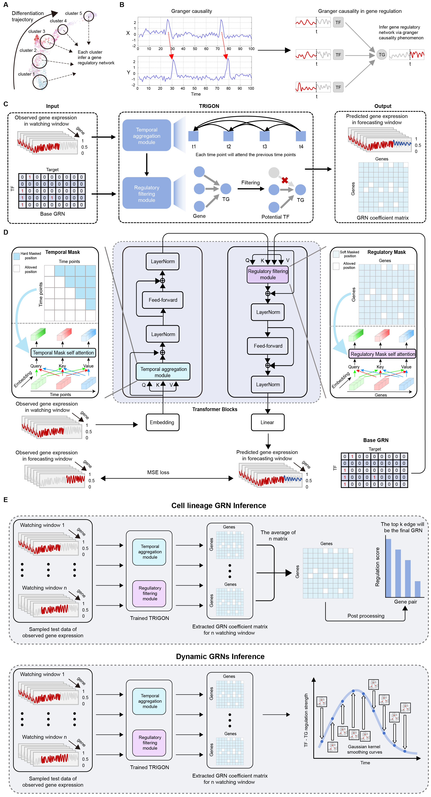

# TRIGON
---
TRIGON is a Transformer-based model that predicts the expression of target genes after time point t through the expression of transcription factors from the previous time points, thereby learning the causal relationships of genes over time. TRIGON achieved the best performance across four differentiation datasets compared to seven baseline methods. On mouse embryonic stem cell dataset, TRIGON successfully identified previously reported transcription factors and discovered a group of potential TFs related to primitive endoderm development. TRIGON is capable of constructing dynamic gene regulatory network with different temporal resolutions, enabling the observation of GRN changes across varying time scales. Finally, we applied TRIGON to mouse hematopoietic stem cell dataset and, through in silico perturbation, reproduced the changes in cell fate following the knockout of Gata1 and Spi1. We believe that TRIGON is an innovative dynamic modeling framework that provides deeper insights into gene regulation during biological differentiation processes.

## Installation
---
TRIGON was originally tested on Ubuntu 20.04 with Python 3.10. We recommend running TRIGON on CUDA if possible. 

## Setup a conda environment
`conda create -n TRIGON python=3.10`

## Install requirements
1. `pip install celloracle`
2. `conda install pytorch==1.13.1 torchvision==0.14.1 torchaudio==0.13.1 pytorch-cuda=11.7 -c pytorch -c nvidia`
3. `pip install pytorch_warmup`
4. `pip install einops`

## Usage example
---
1. `conda activate TRIGON`

2. `bash run.sh`

### input data
- scRNA-seq data: a `.csv` file in which rows represent cells and columns represent genes
- Prior gene interaction network: an edgelist formatted network file. We provide prior gene interaction networks for mouse, located in `./Prior`.
- Gene differential expression level: a 'csv' file contains the log fold change of each gene.
- Pseudotime data: a `.csv` file represents the pseudotime calculated for each cell using the Slingshot algorithm.

### output
A *output* folder in current directory will be generated, which will contain four subfolders named after the datasets. There is a **whole_metric.csv** file in *output* folder, which saves the results of the AUPRC, and AUROC metrics for each method.

## Todo list
- [ ] Upload the code for identifying key TFs
- [ ] Upload the mESC Hi-C and scATAC data along with data processing code
- [ ] Upload the code for dynamic GRN construction
- [ ] Upload the code for in silico perturbation

## Bugs & Suggestions
---
Please contact prchengdu@gmail.com or raise an issue in the github repo with any questions.