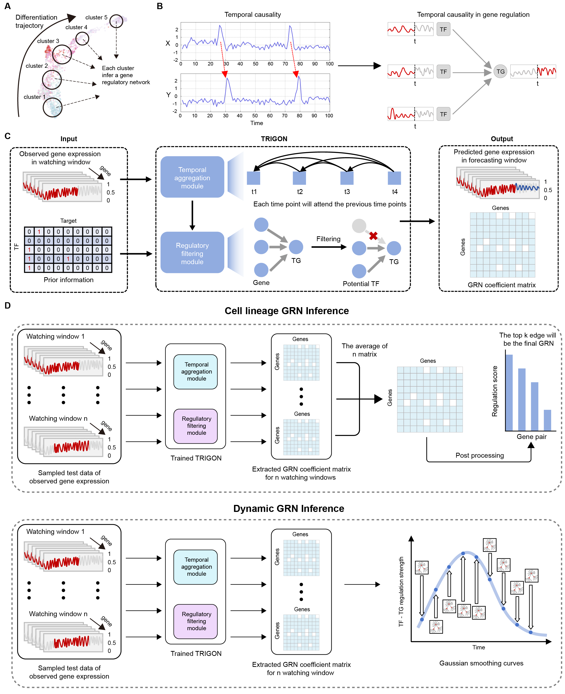

# TRIGON: Dissecting dynamic gene regulatory network using self-supervised temporal causality analysis

> ✨Decoding dynamic gene regulatory networks during cell development and disease progression


## Overview
TRIGON is a Transformer-based model that predicts the expression of target genes after time point t through the expression of transcription factors from the previous time points, thereby learning the causal relationships of genes over time. TRIGON achieved the best performance across four differentiation datasets compared to seven baseline methods. On mouse embryonic stem cell dataset, TRIGON successfully identified previously reported transcription factors and discovered a group of potential TFs related to primitive endoderm development. TRIGON is capable of constructing dynamic gene regulatory network with different temporal resolutions, enabling the observation of GRN changes across varying time scales. Finally, we applied TRIGON to mouse hematopoietic stem cell dataset and, through in silico perturbation, reproduced the changes in cell fate following the knockout of Gata1 and Spi1. We believe that TRIGON is an innovative dynamic modeling framework that provides deeper insights into gene regulation during biological differentiation processes.

## Why TRIGON?
- ⏱️ **Temporal Causality Analysis**: TRIGON decodes gene expression dynamics during cell development by analyzing temporal regulatory relationships.
- 🔄 **Dynamic GRN Construction**: TRIGON is capable of constructing dynamic gene regulatory network with different temporal resolutions, enabling the observation of GRN changes across varying time scales.
- 🧬 **In Silico Perturbation**: TRIGON can reproduce the changes in cell fate following the knockout of key transcription factors.
- 🧫 **Single-modality Excellence**: TRIGON achieves state-of-the-art performance using only scRNA-seq data, outperforming multi-modal methods while requiring less data and information.
- 🔬 **Broad Applicability**: Unlike multi-modal approaches that require diverse and matched data, TRIGON's single-modality nature makes it highly adaptable and practical for real-world applications across different biological contexts.
- 💻 **Computational Efficiency**: TRIGON demonstrates superior computational speed compared to existing methods, enabling faster analysis of large-scale datasets.



## Quick Links
- [Installation](#installation)
- [Input data](#input-data)
- [Training & Inference](#training--inference)
- [Output GRN](#output-grn)
- [Baseline Model reproduction](#baseline-model-reproduction)
- [Data for ATAC & Hi-C](#data-for-atac--hic)
- [Data for Gata1 knockout](#data-for-gata1-knockout)
- [Todo list](#todo-list)
- [Contact](#contact)
- [Citation](#citation)

## Installation
1. Clone the repository to your local machine and enter the repository in the command line interface.
```
git clone https://github.com/prsigma/TRIGON.git
cd TRIGON
```

2. Use conda to create a new environment according to environment.yaml
```
conda env create -f environment.yaml
```
3. Install relevant requirements
```
conda activate TRIGON
pip install -r requirements.txt
pip install celloracle
```

**IMPORTANT NOTE**: For servers with cuda lower than 11.7, consider upgrading cuda or install ```pytorch``` with cpu version.

## Input data
TRIGON accepts the following data as input:
- **scRNA-seq data**: a `.csv` file in which rows represent cells and columns represent genes, or a custom ```.h5ad``` file provided by the user.
- **Pseudotime for each cell**: a `.csv` file represents the pseudotime calculated for each cell, or the pseudotime included in the user-provided ```.h5ad``` file. Users can define their own pseudotime calculation methods. For reference, we provide several commonly used pseudotime calculation methods:
    - [Slingshot](https://bioconductor.org/packages/release/bioc/html/slingshot.html)
    - [Monocle3](https://cole-trapnell-lab.github.io/monocle3/)
    - [PAGA](https://github.com/theislab/paga)
    - [Seurat](https://satijalab.org/seurat/)
    - [Cellrank](https://cellrank.readthedocs.io/en/stable/)
- **Prior gene interaction network**: a `.csv` file, representing the potential regulatory genes and their target genes.
- **Ground truth gene interaction network**: a `.csv` file, representing the experimentally verified regulatory genes and their target genes. The ground truth network is sourced from [BEELINE](https://github.com/Murali-group/Beeline) and obtained through ChIP-seq experiments.
- **Differential gene information**(optional): A `.csv` file containing differential expression information for each gene. In our study, we selected the top 2000 differentially expressed genes for each dataset as input.

***We provide all datasets used in the article for researchers to reproduce the results.***
1. scRNA-seq data and pseudotime information are stored in the `BEELINE-data` folder, with the following structure:
    ```
    BEELINE-data/
    ├── hESC
    │   ├── DEgenes_MAST_sp4_PseudoTime.csv
    │   ├── ExpressionData.csv
    │   ├── GeneOrdering.csv
    │   └── PseudoTime.csv
    ├── hHep
    │   ├── DEgenes_MAST_sp4_PseudoTime.csv
    │   ├── ExpressionData.csv
    │   ├── GeneOrdering.csv
    │   └── PseudoTime.csv
    ├── mDC
    │   ├── DEgenes_MAST_sp4_PseudoTime.csv
    │   ├── ExpressionData.csv
    │   ├── GeneOrdering.csv
    │   └── PseudoTime.csv
    ├── mESC
    │   ├── DEgenes_MAST_sp4_PseudoTime.csv
    │   ├── ExpressionData.csv
    │   ├── GeneOrdering.csv
    │   └── PseudoTime.csv
    ├── mHSC-E
    │   ├── DEgenes_MAST_sp4_PseudoTime.csv
    │   ├── ExpressionData.csv
    │   ├── GeneOrdering.csv
    │   └── PseudoTime.csv
    ├── mHSC-GM
    │   ├── DEgenes_MAST_sp4_PseudoTime.csv
    │   ├── ExpressionData.csv
    │   ├── GeneOrdering.csv
    │   └── PseudoTime.csv
    └── mHSC-L
        ├── DEgenes_MAST_sp4_PseudoTime.csv
        ├── ExpressionData.csv
        ├── GeneOrdering.csv
        └── PseudoTime.csv
    ```
    `DEgenes_MAST_sp4_PseudoTime.csv` contains the logFC values for each gene, `ExpressionData.csv` contains the gene expression information for each cell, `GeneOrdering.csv` contains the differential gene ordering information, and `PseudoTime.csv` contains the pseudotime information for each cell.
2. Prior gene interaction network is stored in the `Prior` folder, with the following structure:
    ```
    Prior/
    ├── network_human_merged.csv
    └── network_mouse_merged.csv
    ```
    We provide the prior gene interaction network for human and mouse extracted from [NicheNet](https://nichenet.be/), which includes two columns representing the potential regulatory genes and their target genes.
3. Ground truth gene interaction network is stored in the `BEELINE-Networks` folder, with the following structure:
    ```
    BEELINE-Networks/
    ├── hESC-ChIP-seq-network.csv
    ├── hHep-ChIP-seq-network.csv
    ├── mDC-ChIP-seq-network.csv
    ├── mESC-ChIP-seq-network.csv
    └── mHSC-ChIP-seq-network.csv
    ```
    `hESC-ChIP-seq-network.csv` contains the ChIP-seq data for hESC dataset,
    `hHep-ChIP-seq-network.csv` contains the ChIP-seq data for hHep dataset,
    `mDC-ChIP-seq-network.csv` contains the ChIP-seq data for mDC dataset,
    `mESC-ChIP-seq-network.csv` contains the ChIP-seq data for mESC dataset and  `mHSC-ChIP-seq-network.csv` contains the ChIP-seq data for mHSC dataset,
    ``

## Training & Inference
We created a shell script `run.sh` to run the training process. The script integrates all the datasets we use (mESC, mHSC-GM, mHSC-L, mHSC-E), allowing us to obtain results for all datasets in one run. You can use the following code to run TRIGON:
```
conda activate TRIGON
bash run.sh
```

## Output GRN
A `output` folder in current directory will be generated, which will contain four subfolders named after the datasets, with the following structure:
```
output/
├── hESC
│   ├── allNodes.csv
│   ├── end_tf.csv
│   ├── expression.csv
│   ├── gt_grn.csv  
│   └── TRIGON
│       ├── checkpoint.pth   #trained model file
│       ├── grn.csv         #inferred GRN for hESC
│       ├── trigon_cell_sort.csv
│       └── trigon_expression.csv
├── hHep
│   ├── allNodes.csv
│   ├── end_tf.csv
│   ├── expression.csv
│   ├── gt_grn.csv
│   └── TRIGON
│       ├── checkpoint.pth   #trained model file
│       ├── grn.csv         #inferred GRN for hHep
│       ├── trigon_cell_sort.csv
│       └── trigon_expression.csv
├── mDC
│   ├── allNodes.csv
│   ├── end_tf.csv
│   ├── expression.csv
│   ├── gt_grn.csv
│   └── TRIGON
│       ├── checkpoint.pth   #trained model file
│       ├── grn.csv         #inferred GRN for mDC
│       ├── trigon_cell_sort.csv
│       └── trigon_expression.csv
├── mESC
│   ├── allNodes.csv
│   ├── end_tf.csv
│   ├── expression.csv
│   ├── gt_grn.csv  
│   └── TRIGON
│       ├── checkpoint.pth   #trained model file
│       ├── grn.csv         #inferred GRN for mESC
│       ├── trigon_cell_sort.csv
│       └── trigon_expression.csv
├── mHSC-E
│   ├── allNodes.csv
│   ├── end_tf.csv
│   ├── expression.csv
│   ├── gt_grn.csv
│   └── TRIGON
│       ├── checkpoint.pth   #trained model file
│       ├── grn.csv         #inferred GRN for mHSC-E
│       ├── trigon_cell_sort.csv
│       └── trigon_expression.csv
├── mHSC-GM
│   ├── allNodes.csv
│   ├── end_tf.csv
│   ├── expression.csv
│   ├── gt_grn.csv
│   └── TRIGON
│       ├── checkpoint.pth   #trained model file
│       ├── grn.csv         #inferred GRN for mHSC-GM
│       ├── trigon_cell_sort.csv
│       └── trigon_expression.csv
└── mHSC-L
    ├── allNodes.csv
    ├── end_tf.csv
    ├── expression.csv
    ├── gt_grn.csv
    └── TRIGON
        ├── checkpoint.pth   #trained model file
        ├── grn.csv         #inferred GRN for mHSC-L
        ├── trigon_cell_sort.csv
        └── trigon_expression.csv
```
In the `TRIGON` folder of each dataset, we provide the trained model file `checkpoint.pth` and the predicted GRN file `grn.csv`.

## Baseline Model reproduction
We provide the code for reproducing the results of the baseline models in `baseline_models.py`. We compared a total of seven baseline models, including:
- [Celloracle](https://www.nature.com/articles/s41586-022-05688-9) (*2023 Nature*)
- [CEFCON](https://www.nature.com/articles/s41467-023-44103-3) (*2023 Nature Communications*)
- [GRNBoost2](https://academic.oup.com/bioinformatics/article/35/12/2159/5184284) (*2019 Bioinformatics*)
- [NetREX](https://www.nature.com/articles/s41467-018-06382-z) (*2018 Nature Communications*)
- [GENIE3](https://journals.plos.org/plosone/article?id=10.1371/journal.pone.0012776) (*highly cited paper*)
- [GRANGER](https://academic.oup.com/bib/article/26/2/bbaf089/8068119) (2025 Briefings in Bioinformatics)
- [Inferelator](https://academic.oup.com/bioinformatics/article/38/9/2519/6533443?login=false) (2022 Bioinformatics)
- Random: Used to evaluate the performance of randomly selecting edges as the inferred GRN.
- Prior_Random: Used to evaluate the performance of randomly selecting edges from the prior network as the inferred GRN.
1. You can simply use the following command to run the baseline models:
    ```
    conda activate TRIGON
    bash run_baseline.sh
    ```
2. When finished, you will find the corresponding `grn.csv` files in the corresponding algorithm name folder (except for CEFCON algorithm, the generated file is `cell_lineage_GRN.csv`):
3. Run the following command to calculate the AUPRC and AUROC metrics for each method:
    ```
    conda activate TRIGON
    python compute_baseline_metrcs.py
    ```
    When finished, you will find a `whole_metric.csv` file in the `output` folder, which saves the results of the AUPRC, and AUROC metrics for each method. You will also find the corresponding ROC curve (`roc_curve.png`) and PR curve (`pr_curve.png`) for each algorithm in their respective folders.

The final results in the `output` folder are as follows:
```
output/
├── mESC
│   ├── allNodes.csv
│   ├── CEFCON
│   │   └── cell_lineage_GRN.csv    #inferred GRN for CEFCON of mESC
│   ├── Celloracle
│   │   └── grn.csv     #inferred GRN for Celloracle of mESC
│   ├── end_tf.csv
│   ├── expression.csv
│   ├── GENIE3
│   │   ├── grn.csv     #inferred GRN for GENIE3 of mESC
│   │   └── tf_names.txt
│   ├── GRANGER
│   │   └── grn.csv     #inferred GRN for GRANGER of mESC
│   ├── GRNBoost2
│   │   ├── grn.csv     #inferred GRN for GRNBoost2 of mESC
│   │   └── tf_names.txt
│   ├── gt_grn.csv      #ground truth GRN of mESC
│   ├── Inferelator
│   │   └── grn.csv     #inferred GRN for Inferelator of mESC
│   ├── NetREX
│   │   ├── expression.txt
│   │   ├── grn.csv     #inferred GRN for NetREX of mESC
│   │   ├── NetREX_PredictedEdgeList.txt
│   │   ├── NetREX_PredictedNetwork.tsv
│   │   └── prior_grn.txt
│   ├── pr_curve.png    #PR curve of all methods for mESC
│   ├── Prior_Random
│   │   └── grn.csv     #inferred GRN for Prior_Random of mESC
│   ├── Random
│   │   └── grn.csv     #inferred GRN for Random of mESC
│   ├── roc_curve.png   #ROC curve of all methods for mESC
│   └── TRIGON
│       ├── checkpoint.pth  
│       ├── grn.csv     #inferred GRN for TRIGON of mESC
│       ├── trigon_cell_sort.csv
│       └── trigon_expression.csv
├── mHSC-E
│   ├── allNodes.csv
│   ├── CEFCON
│   │   └── cell_lineage_GRN.csv    #inferred GRN for CEFCON of mHSC-E
│   ├── Celloracle
│   │   └── grn.csv     #inferred GRN for Celloracle of mHSC-E
│   ├── end_tf.csv
│   ├── expression.csv
│   ├── GENIE3
│   │   ├── grn.csv     #inferred GRN for GENIE3 of mHSC-E
│   │   └── tf_names.txt
│   ├── GRANGER
│   │   └── grn.csv     #inferred GRN for GRANGER of mHSC-E
│   ├── GRNBoost2
│   │   ├── grn.csv     #inferred GRN for GRNBoost2 of mHSC-E
│   │   └── tf_names.txt
│   ├── gt_grn.csv      #ground truth GRN of mHSC-E
│   ├── Inferelator
│   │   └── grn.csv     #inferred GRN for Inferelator of mHSC-E
│   ├── NetREX
│   │   ├── expression.txt
│   │   ├── grn.csv     #inferred GRN for NetREX of mHSC-E
│   │   ├── NetREX_PredictedEdgeList.txt
│   │   ├── NetREX_PredictedNetwork.tsv
│   │   └── prior_grn.txt
│   ├── pr_curve.png    #PR curve of all methods for mHSC-E
│   ├── Prior_Random
│   │   └── grn.csv     #inferred GRN for Prior_Random of mHSC-E
│   ├── Random
│   │   └── grn.csv     #inferred GRN for Random of mHSC-E
│   ├── roc_curve.png   #ROC curve of all methods for mHSC-E
│   └── TRIGON
│       ├── checkpoint.pth
│       ├── grn.csv     #inferred GRN for TRIGON of mHSC-E
│       ├── trigon_cell_sort.csv
│       └── trigon_expression.csv
├── mHSC-GM
│   ├── allNodes.csv
│   ├── CEFCON
│   │   └── cell_lineage_GRN.csv    #inferred GRN for CEFCON of mHSC-GM
│   ├── Celloracle
│   │   └── grn.csv     #inferred GRN for Celloracle of mHSC-GM
│   ├── end_tf.csv
│   ├── expression.csv
│   ├── GENIE3
│   │   ├── grn.csv     #inferred GRN for GENIE3 of mHSC-GM
│   │   └── tf_names.txt
│   ├── GRANGER
│   │   └── grn.csv     #inferred GRN for GRANGER of mHSC-GM
│   ├── GRNBoost2
│   │   ├── grn.csv     #inferred GRN for GRNBoost2 of mHSC-GM
│   │   └── tf_names.txt
│   ├── gt_grn.csv      #ground truth GRN of mHSC-GM
│   ├── Inferelator
│   │   └── grn.csv     #inferred GRN for Inferelator of mHSC-GM
│   ├── NetREX
│   │   ├── expression.txt
│   │   ├── grn.csv     #inferred GRN for NetREX of mHSC-GM
│   │   ├── NetREX_PredictedEdgeList.txt
│   │   ├── NetREX_PredictedNetwork.tsv
│   │   └── prior_grn.txt
│   ├── pr_curve.png    #PR curve of all methods for mHSC-GM
│   ├── Prior_Random
│   │   └── grn.csv     #inferred GRN for Prior_Random of mHSC-GM   
│   ├── Random
│   │   └── grn.csv     #inferred GRN for Random of mHSC-GM
│   ├── roc_curve.png   #ROC curve of all methods for mHSC-GM
│   └── TRIGON
│       ├── checkpoint.pth
│       ├── grn.csv     #inferred GRN for TRIGON of mHSC-GM
│       ├── trigon_cell_sort.csv
│       └── trigon_expression.csv
├── mHSC-L
│   ├── allNodes.csv
│   ├── CEFCON
│   │   └── cell_lineage_GRN.csv    #inferred GRN for CEFCON of mHSC-L
│   ├── Celloracle
│   │   └── grn.csv     #inferred GRN for Celloracle of mHSC-L
│   ├── end_tf.csv
│   ├── expression.csv
│   ├── GENIE3
│   │   ├── grn.csv     #inferred GRN for GENIE3 of mHSC-L
│   │   └── tf_names.txt
│   ├── GRANGER
│   │   └── grn.csv     #inferred GRN for GRANGER of mHSC-L
│   ├── GRNBoost2
│   │   ├── grn.csv     #inferred GRN for GRNBoost2 of mHSC-L
│   │   └── tf_names.txt
│   ├── gt_grn.csv      #ground truth GRN of mHSC-L
│   ├── Inferelator
│   │   └── grn.csv     #inferred GRN for Inferelator of mHSC-L
│   ├── NetREX
│   │   ├── expression.txt
│   │   ├── grn.csv     #inferred GRN for NetREX of mHSC-L
│   │   ├── NetREX_PredictedEdgeList.txt
│   │   ├── NetREX_PredictedNetwork.tsv
│   │   └── prior_grn.txt
│   ├── pr_curve.png    #PR curve of all methods for mHSC-L
│   ├── Prior_Random
│   │   └── grn.csv     #inferred GRN for Prior_Random of mHSC-L
│   ├── Random
│   │   └── grn.csv     #inferred GRN for Random of mHSC-L
│   ├── roc_curve.png   #ROC curve of all methods for mHSC-L    
│   └── TRIGON
│       ├── checkpoint.pth
│       ├── grn.csv     #inferred GRN for TRIGON of mHSC-L
│       ├── trigon_cell_sort.csv
│       └── trigon_expression.csv
├── hHep
│   ├── allNodes.csv
│   ├── CEFCON
│   │   └── cell_lineage_GRN.csv    #inferred GRN for CEFCON of hHep
│   ├── Celloracle
│   │   └── grn.csv     #inferred GRN for Celloracle of hHep
│   ├── end_tf.csv
│   ├── expression.csv
│   ├── GENIE3
│   │   ├── grn.csv     #inferred GRN for GENIE3 of hHep
│   │   └── tf_names.txt
│   ├── GRANGER
│   │   └── grn.csv     #inferred GRN for GRANGER of hHep
│   ├── GRNBoost2
│   │   ├── grn.csv     #inferred GRN for GRNBoost2 of hHep
│   │   └── tf_names.txt
│   ├── gt_grn.csv      #ground truth GRN of hHep
│   ├── Inferelator
│   │   └── grn.csv     #inferred GRN for Inferelator of hHep
│   ├── NetREX
│   │   ├── expression.txt
│   │   ├── grn.csv     #inferred GRN for NetREX of hHep
│   │   ├── NetREX_PredictedEdgeList.txt
│   │   ├── NetREX_PredictedNetwork.tsv
│   │   └── prior_grn.txt
│   ├── pr_curve.png    #PR curve of all methods for hHep
│   ├── Prior_Random
│   │   └── grn.csv     #inferred GRN for Prior_Random of hHep
│   ├── Random
│   │   └── grn.csv     #inferred GRN for Random of hHep
│   ├── roc_curve.png   #ROC curve of all methods for hHep
│   └── TRIGON
│       ├── checkpoint.pth
│       ├── grn.csv     #inferred GRN for TRIGON of hHep
│       ├── trigon_cell_sort.csv
│       └── trigon_expression.csv
├── hESC
│   ├── allNodes.csv
│   ├── CEFCON
│   │   └── cell_lineage_GRN.csv    #inferred GRN for CEFCON of hESC
│   ├── Celloracle
│   │   └── grn.csv     #inferred GRN for Celloracle of hESC
│   ├── end_tf.csv
│   ├── expression.csv
│   ├── GENIE3
│   │   ├── grn.csv     #inferred GRN for GENIE3 of hESC
│   │   └── tf_names.txt
│   ├── GRANGER
│   │   └── grn.csv     #inferred GRN for GRANGER of hESC
│   ├── GRNBoost2
│   │   ├── grn.csv     #inferred GRN for GRNBoost2 of hESC
│   │   └── tf_names.txt
│   ├── gt_grn.csv      #ground truth GRN of hESC
│   ├── Inferelator
│   │   └── grn.csv     #inferred GRN for Inferelator of hESC
│   ├── NetREX
│   │   ├── expression.txt
│   │   ├── grn.csv     #inferred GRN for NetREX of hESC
│   │   ├── NetREX_PredictedEdgeList.txt
│   │   ├── NetREX_PredictedNetwork.tsv
│   │   └── prior_grn.txt
│   ├── pr_curve.png    #PR curve of all methods for hESC
│   ├── Prior_Random
│   │   └── grn.csv     #inferred GRN for Prior_Random of hESC
│   ├── Random
│   │   └── grn.csv     #inferred GRN for Random of hESC
│   ├── roc_curve.png   #ROC curve of all methods for hESC
│   └── TRIGON
│       ├── checkpoint.pth
│       ├── grn.csv     #inferred GRN for TRIGON of hESC
│       ├── trigon_cell_sort.csv
│       └── trigon_expression.csv
└── mDC
    ├── allNodes.csv
    ├── CEFCON
    │   └── cell_lineage_GRN.csv    #inferred GRN for CEFCON of mDC
    ├── Celloracle
    │   └── grn.csv     #inferred GRN for Celloracle of mDC
    ├── end_tf.csv
    ├── expression.csv
    ├── GENIE3
    │   ├── grn.csv     #inferred GRN for GENIE3 of mDC
    │   └── tf_names.txt
    ├── GRANGER
    │   └── grn.csv     #inferred GRN for GRANGER of mDC
    ├── GRNBoost2
    │   ├── grn.csv     #inferred GRN for GRNBoost2 of mDC
    │   └── tf_names.txt
    ├── gt_grn.csv      #ground truth GRN of mDC
    ├── Inferelator
    │   └── grn.csv     #inferred GRN for Inferelator of mDC
    ├── NetREX
    │   ├── expression.txt
    │   ├── grn.csv     #inferred GRN for NetREX of mDC
    │   ├── NetREX_PredictedEdgeList.txt
    │   ├── NetREX_PredictedNetwork.tsv
    │   └── prior_grn.txt
    ├── pr_curve.png    #PR curve of all methods for mDC
    ├── Prior_Random
    │   └── grn.csv     #inferred GRN for Prior_Random of mDC
    ├── Random
    │   └── grn.csv     #inferred GRN for Random of mDC
    ├── roc_curve.png   #ROC curve of all methods for mDC
    └── TRIGON
        ├── checkpoint.pth
        ├── grn.csv     #inferred GRN for TRIGON of mDC
        ├── trigon_cell_sort.csv
        └── trigon_expression.csv

```

## Data for ATAC & Hi-C
In the article, we used the ATAC and Hi-C data from other studies, which are deposited in Gene Expression Omnibus (GEO). You can find the data in the following links:
- reference paper: [Relaxed 3D genome conformation facilitates the pluripotent to totipotent-like state transition in embryonic stem cells](https://academic.oup.com/nar/article/49/21/12167/6430492)
- Data: [ATAC-seq & Hi-C data](https://www.ncbi.nlm.nih.gov/geo/query/acc.cgi?acc=GSE159623)

## Data for Gata1 knockout
In the article, we used the Gata1 knockout data from other studies to verify the effectiveness of our model in predicting the changes in cell fate. You can find the data in the following links:
- Data: [Gata1 knockout data](https://www.ncbi.nlm.nih.gov/geo/query/acc.cgi?acc=GSE279985)

## Todo list
- [ ] upload the instruction of R environment for reproducing the results
- [ ] Upload the code for identifying key TFs
- [ ] Upload the mESC Hi-C and scATAC data along with data processing code
- [ ] Upload the code for dynamic GRN construction
- [ ] Upload the code for in silico perturbation
- [ ] Upload the tutorail notebook for reproducing the results

## Contact
If you find any bugs or have any suggestions, please contact prchengdu@gmail.com or raise an issue in the github repo.

## Citation
If you find this work useful, please consider citing:
```bibtex
@article{peng2025dissecting,
  title={Dissecting dynamic gene regulatory network using transformer-based temporal causality analysis},
  author={Peng, Rui and Qi, Juntian and Lu, Yuxing and Wu, Wei and Sun, Qichen and Zhang, Chi and Chen, Yihan and Wang, Jinzhuo},
  journal={bioRxiv},
  pages={2025--02},
  year={2025},
  publisher={Cold Spring Harbor Laboratory}
}
```